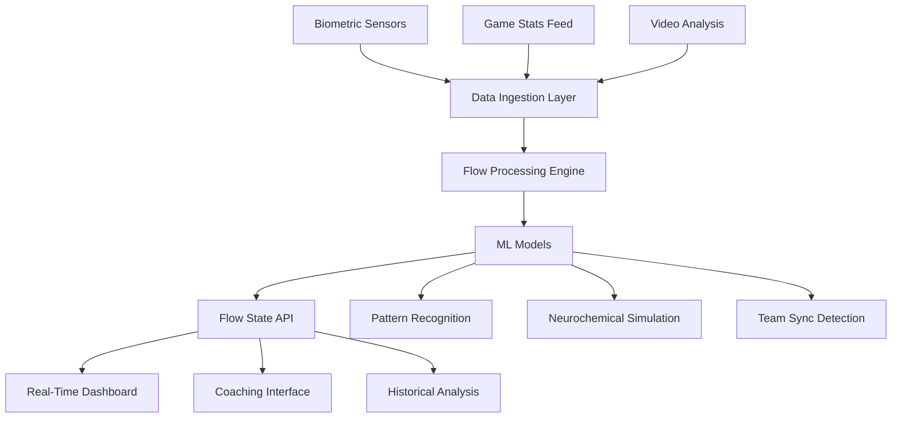

# Blaze Intelligence Flow State Detection System
## Technical Implementation Specification v1.0

### System Architecture



---

## Core Algorithms

### 1. Flow State Detection Algorithm

```typescript
// Flow State Detection Core Algorithm
// Integrates with existing Blaze Intelligence infrastructure

interface FlowMetrics {
  challengeSkillBalance: number;  // 0-1 scale
  actionAwareness: number;        // Merge of action/awareness
  concentration: number;           // Focus intensity
  controlSense: number;           // Perceived control
  selfConsciousness: number;      // Inverse scale (lower = better)
  timePerception: number;         // Time distortion events
  immediacy: number;              // Reaction time variance
  consistency: number;            // Performance stability
}

interface BiometricData {
  heartRateVariability: number;
  heartRate: number;
  galvanicSkinResponse?: number;
  eegTheta?: number;              // 4-8 Hz activity
  eegAlpha?: number;              // 8-12 Hz activity
  movementEfficiency: number;
}

class FlowDetector {
  private readonly FLOW_THRESHOLD = 0.75;
  private readonly WINDOW_SIZE = 300; // 5 minutes in seconds
  private performanceBaseline: Map<string, number> = new Map();
  
  /**
   * Main flow detection algorithm combining performance and biometric data
   */
  calculateFlowScore(
    playerId: string,
    performance: PerformanceMetrics,
    biometrics: BiometricData,
    context: GameContext
  ): FlowState {
    
    // Step 1: Calculate performance-based flow indicators
    const perfFlow = this.calculatePerformanceFlow(playerId, performance);
    
    // Step 2: Calculate biometric flow indicators
    const bioFlow = this.calculateBiometricFlow(biometrics);
    
    // Step 3: Apply context modifiers
    const contextMod = this.calculateContextModifier(context);
    
    // Step 4: Weighted combination
    const rawScore = (perfFlow * 0.6) + (bioFlow * 0.3) + (contextMod * 0.1);
    
    // Step 5: Apply temporal smoothing
    const smoothedScore = this.temporalSmoothing(playerId, rawScore);
    
    // Step 6: Detect flow state transitions
    const state = this.detectStateTransition(playerId, smoothedScore);
    
    return {
      playerId,
      score: smoothedScore,
      state: state,
      dimensions: this.calculateDimensions(performance, biometrics),
      confidence: this.calculateConfidence(perfFlow, bioFlow),
      timestamp: Date.now(),
      predictedDuration: this.predictDuration(smoothedScore, state)
    };
  }
  
  /**
   * Performance-based flow calculation
   * Uses decision velocity, pattern recognition, and consistency
   */
  private calculatePerformanceFlow(
    playerId: string, 
    metrics: PerformanceMetrics
  ): number {
    const baseline = this.performanceBaseline.get(playerId) || 
                    this.calculateBaseline(playerId);
    
    // Decision Velocity Score (faster decisions = higher flow)
    const decisionVelocity = Math.min(
      metrics.reactionTime / baseline.reactionTime, 
      1.5
    );
    
    // Pattern Recognition Efficiency
    const patternScore = metrics.patternRecognitionAccuracy * 
                        (metrics.patternRecognitionSpeed / baseline.patternSpeed);
    
    // Consistency Score (low variance = flow state)
    const consistency = 1 - (metrics.performanceVariance / baseline.variance);
    
    // Automaticity Index (less conscious processing)
    const automaticity = this.calculateAutomaticity(metrics);
    
    // Challenge-Skill Balance (optimal = 1.04, representing 4% above skill)
    const challengeBalance = this.gaussianScore(
      metrics.taskDifficulty / metrics.skillLevel,
      1.04,  // optimal point
      0.08   // standard deviation
    );
    
    return (
      decisionVelocity * 0.25 +
      patternScore * 0.20 +
      consistency * 0.20 +
      automaticity * 0.20 +
      challengeBalance * 0.15
    );
  }
  
  /**
   * Biometric-based flow indicators
   * Based on neuroscience research on flow states
   */
  private calculateBiometricFlow(bio: BiometricData): number {
    let score = 0;
    let weight = 0;
    
    // HRV in optimal zone (not too high, not too low)
    if (bio.heartRateVariability !== undefined) {
      const hrvScore = this.gaussianScore(bio.heartRateVariability, 55, 15);
      score += hrvScore * 0.3;
      weight += 0.3;
    }
    
    // Moderate arousal (heart rate slightly elevated but not stressed)
    const hrScore = this.gaussianScore(
      bio.heartRate, 
      0.7, // 70% of max HR
      0.15
    );
    score += hrScore * 0.2;
    weight += 0.2;
    
    // EEG indicators if available
    if (bio.eegTheta !== undefined && bio.eegAlpha !== undefined) {
      // Increased frontal theta (4-8 Hz) indicates deep focus
      const thetaScore = Math.min(bio.eegTheta / 20, 1); // normalize
      
      // Moderate alpha (8-12 Hz) indicates relaxed focus
      const alphaScore = this.gaussianScore(bio.eegAlpha, 15, 5);
      
      score += (thetaScore * 0.25 + alphaScore * 0.25);
      weight += 0.5;
    }
    
    // Movement efficiency (smooth, fluid movements)
    const efficiencyScore = bio.movementEfficiency;
    score += efficiencyScore * 0.2;
    weight += 0.2;
    
    return weight > 0 ? score / weight : 0;
  }
  
  /**
   * Automaticity calculation - key indicator of flow
   * Measures how "automatic" performance feels
   */
  private calculateAutomaticity(metrics: PerformanceMetrics): number {
    const factors = {
      // Reduced conscious decision time
      decisionSpeed: Math.min(1000 / metrics.decisionTime, 1),
      
      // Smooth action sequences
      sequenceSmooth: 1 - metrics.hesitationEvents / metrics.totalActions,
      
      // Reduced error correction (actions are right first time)
      firstTimeSuccess: metrics.firstAttemptSuccess / metrics.totalAttempts,
      
      // Predictive accuracy (anticipating correctly)
      anticipation: metrics.correctPredictions / metrics.totalPredictions
    };
    
    return (
      factors.decisionSpeed * 0.3 +
      factors.sequenceSmooth * 0.3 +
      factors.firstTimeSuccess * 0.2 +
      factors.anticipation * 0.2
    );
  }
  
  /**
   * Gaussian scoring function for optimal range values
   */
  private gaussianScore(value: number, mean: number, stdDev: number): number {
    const exponent = -Math.pow(value - mean, 2) / (2 * Math.pow(stdDev, 2));
    return Math.exp(exponent);
  }
  
  /**
   * State machine for flow transitions
   */
  private detectStateTransition(
    playerId: string, 
    score: number
  ): FlowStateType {
    const history = this.getPlayerHistory(playerId);
    const previousState = history.currentState || FlowStateType.NORMAL;
    
    // State transition thresholds with hysteresis to prevent flickering
    const transitions = {
      enteringFlow: 0.65,
      inFlow: 0.75,
      deepFlow: 0.85,
      exitingFlow: 0.60
    };
    
    switch (previousState) {
      case FlowStateType.NORMAL:
        if (score > transitions.enteringFlow) {
          return FlowStateType.ENTERING_FLOW;
        }
        break;
        
      case FlowStateType.ENTERING_FLOW:
        if (score > transitions.inFlow) {
          return FlowStateType.IN_FLOW;
        } else if (score < transitions.exitingFlow) {
          return FlowStateType.NORMAL;
        }
        break;
        
      case FlowStateType.IN_FLOW:
        if (score > transitions.deepFlow) {
          return FlowStateType.DEEP_FLOW;
        } else if (score < transitions.exitingFlow) {
          return FlowStateType.EXITING_FLOW;
        }
        break;
        
      case FlowStateType.DEEP_FLOW:
        if (score < transitions.inFlow) {
          return FlowStateType.IN_FLOW;
        }
        break;
        
      case FlowStateType.EXITING_FLOW:
        if (score < transitions.exitingFlow) {
          return FlowStateType.NORMAL;
        } else if (score > transitions.inFlow) {
          return FlowStateType.IN_FLOW;
        }
        break;
    }
    
    return previousState;
  }
  
  /**
   * Predict how long flow state will last based on current indicators
   */
  private predictDuration(score: number, state: FlowStateType): number {
    // Based on research showing average flow duration of 8-15 minutes
    const baseDuration = 480; // 8 minutes in seconds
    
    const modifiers = {
      scoreMultiplier: score, // Higher score = longer duration
      stateMultiplier: state === FlowStateType.DEEP_FLOW ? 1.5 : 
                      state === FlowStateType.IN_FLOW ? 1.0 : 0.5,
      fatigueFactor: this.calculateFatigueFactor(), // Reduces over time
      experienceFactor: this.getExperienceFactor() // Experts maintain longer
    };
    
    return Math.round(
      baseDuration * 
      modifiers.scoreMultiplier * 
      modifiers.stateMultiplier * 
      modifiers.fatigueFactor * 
      modifiers.experienceFactor
    );
  }
}
```

### 2. Team Flow Synchronization

```typescript
// Team Flow Detection - Measures collective flow state
class TeamFlowAnalyzer {
  
  /**
   * Detects when multiple players enter synchronized flow state
   * Critical for team sports performance
   */
  calculateTeamFlow(
    teamId: string,
    playerFlowStates: FlowState[],
    teamMetrics: TeamPerformanceMetrics
  ): TeamFlowState {
    
    // Individual flow aggregation
    const avgIndividualFlow = this.calculateAverageFlow(playerFlowStates);
    
    // Synchronization metrics
    const syncScore = this.calculateSynchronization(teamMetrics);
    
    // Communication efficiency (less verbal, more intuitive)
    const commEfficiency = this.calculateCommunicationEfficiency(teamMetrics);
    
    // Shared mental models (team thinking alike)
    const sharedModels = this.calculateSharedMentalModels(teamMetrics);
    
    // Collective efficacy (team confidence)
    const collectiveEfficacy = teamMetrics.teamConfidence;
    
    const teamFlowScore = 
      avgIndividualFlow * 0.3 +
      syncScore * 0.25 +
      commEfficiency * 0.2 +
      sharedModels * 0.15 +
      collectiveEfficacy * 0.1;
    
    return {
      teamId,
      score: teamFlowScore,
      synchronization: syncScore,
      playerStates: playerFlowStates,
      triggers: this.identifyTeamTriggers(teamMetrics),
      recommendations: this.generateTeamRecommendations(teamFlowScore, syncScore)
    };
  }
  
  /**
   * Measures how synchronized team movements and decisions are
   */
  private calculateSynchronization(metrics: TeamPerformanceMetrics): number {
    const factors = {
      // Temporal synchrony (acting in unison)
      temporalSync: 1 - metrics.timingVariance / metrics.avgReactionTime,
      
      // Spatial synchrony (positioning coordination)
      spatialSync: metrics.formationCoherence,
      
      // Decision synchrony (making similar choices)
      decisionSync: metrics.sharedDecisions / metrics.totalDecisions,
      
      // Rhythm synchrony (matching pace)
      rhythmSync: 1 - metrics.paceVariance / metrics.avgPace
    };
    
    return (
      factors.temporalSync * 0.3 +
      factors.spatialSync * 0.3 +
      factors.decisionSync * 0.2 +
      factors.rhythmSync * 0.2
    );
  }
  
  /**
   * Identifies what triggered team flow state
   */
  private identifyTeamTriggers(metrics: TeamPerformanceMetrics): string[] {
    const triggers = [];
    
    if (metrics.sharedGoalClarity > 0.8) {
      triggers.push('shared_clear_goals');
    }
    
    if (metrics.trustLevel > 0.85) {
      triggers.push('high_mutual_trust');
    }
    
    if (metrics.communicationDensity < 0.3) {
      triggers.push('intuitive_communication');
    }
    
    if (metrics.collectiveFocus > 0.8) {
      triggers.push('collective_concentration');
    }
    
    if (metrics.riskTaking > 0.7) {
      triggers.push('shared_risk_taking');
    }
    
    return triggers;
  }
}
```

### 3. Flow Prediction Model

```typescript
// ML-based flow prediction using historical patterns
class FlowPredictor {
  private model: FlowPredictionModel;
  
  /**
   * Predicts probability of entering flow in next N minutes
   */
  async predictFlowProbability(
    playerId: string,
    currentState: PlayerState,
    gameContext: GameContext,
    horizonMinutes: number = 5
  ): Promise<FlowPrediction> {
    
    // Feature extraction
    const features = this.extractFeatures(playerId, currentState, gameContext);
    
    // Run through trained model
    const probability = await this.model.predict(features);
    
    // Identify optimal triggers for this player
    const triggers = this.identifyOptimalTriggers(playerId, features);
    
    // Calculate confidence based on data quality
    const confidence = this.calculatePredictionConfidence(features);
    
    return {
      playerId,
      probability,
      horizon: horizonMinutes,
      confidence,
      triggers,
      recommendations: this.generateRecommendations(probability, triggers)
    };
  }
  
  /**
   * Extract features for ML model
   */
  private extractFeatures(
    playerId: string,
    state: PlayerState,
    context: GameContext
  ): FeatureVector {
    
    const historicalFeatures = {
      avgFlowFrequency: this.getHistoricalFlowFrequency(playerId),
      avgFlowDuration: this.getHistoricalFlowDuration(playerId),
      flowInSimilarContext: this.getSimilarContextFlow(playerId, context),
      timeSinceLastFlow: this.getTimeSinceLastFlow(playerId),
      personalityTraits: this.getPersonalityProfile(playerId)
    };
    
    const currentFeatures = {
      // Performance trajectory
      performanceTrend: state.recentPerformanceTrend,
      confidenceLevel: state.currentConfidence,
      fatigueLevel: state.physicalFatigue + state.mentalFatigue,
      
      // Current flow indicators
      currentFlowScore: state.flowScore || 0,
      concentrationLevel: state.focusIntensity,
      anxietyLevel: state.anxietyScore,
      
      // Biometrics if available
      hrvTrend: state.biometrics?.hrvTrend,
      arousalLevel: state.biometrics?.arousal
    };
    
    const contextFeatures = {
      // Game situation
      gameImportance: context.stakes,
      timeRemaining: context.timeRemaining,
      scoreDifferential: context.teamScore - context.opponentScore,
      momentum: context.momentumScore,
      
      // Environmental
      crowdEnergy: context.crowdNoiseLevel,
      familiar_venue: context.isHomeGame ? 1 : 0,
      
      // Challenge-skill
      opponentStrength: context.opponentRating,
      matchup_difficulty: context.matchupDifficulty,
      challengeSkillRatio: context.challengeLevel / state.skillLevel
    };
    
    return {
      ...historicalFeatures,
      ...currentFeatures,
      ...contextFeatures
    };
  }
  
  /**
   * Generate actionable recommendations to induce flow
   */
  private generateRecommendations(
    probability: number,
    triggers: FlowTrigger[]
  ): FlowRecommendation[] {
    const recommendations = [];
    
    if (probability < 0.3) {
      // Low flow probability - need intervention
      recommendations.push({
        action: 'reduce_challenge',
        description: 'Lower task difficulty by 10-15% to rebuild confidence',
        priority: 'high'
      });
      
      recommendations.push({
        action: 'mindfulness_reset',
        description: '60-second breathing exercise to reduce anxiety',
        priority: 'high'
      });
    } else if (probability < 0.6) {
      // Moderate probability - optimize conditions
      recommendations.push({
        action: 'clarify_goals',
        description: 'Set specific next-play objective',
        priority: 'medium'
      });
      
      recommendations.push({
        action: 'increase_focus',
        description: 'Eliminate distractions, narrow attention',
        priority: 'medium'
      });
    } else {
      // High probability - maintain conditions
      recommendations.push({
        action: 'maintain_rhythm',
        description: 'Keep current pace and intensity',
        priority: 'low'
      });
    }
    
    // Add trigger-specific recommendations
    triggers.forEach(trigger => {
      recommendations.push(this.getTriggerRecommendation(trigger));
    });
    
    return recommendations.sort((a, b) => 
      this.getPriorityScore(b.priority) - this.getPriorityScore(a.priority)
    );
  }
}
```

### 4. Real-Time Processing Pipeline

```typescript
// Real-time flow processing using existing Blaze infrastructure
class FlowProcessingPipeline {
  private readonly PROCESSING_INTERVAL = 100; // ms (matching <100ms SLA)
  private readonly BUFFER_SIZE = 50;
  
  /**
   * Main processing loop for real-time flow detection
   */
  async processFlowStream(
    dataStream: DataStream,
    outputHandler: (flow: FlowUpdate) => void
  ): Promise<void> {
    
    const buffer = new CircularBuffer<RawData>(this.BUFFER_SIZE);
    
    // Process incoming data at 10Hz (100ms intervals)
    setInterval(async () => {
      // Collect latest data
      const latestData = await dataStream.getLatest();
      buffer.push(latestData);
      
      // Skip if insufficient data
      if (buffer.size() < 5) return;
      
      // Process each active player
      const players = this.getActivePlayers(latestData);
      
      for (const player of players) {
        const flowUpdate = await this.processPlayer(player, buffer);
        
        if (flowUpdate.hasChanged) {
          outputHandler(flowUpdate);
        }
      }
      
      // Process team flow
      const teamFlow = await this.processTeamFlow(players, buffer);
      if (teamFlow.hasChanged) {
        outputHandler(teamFlow);
      }
      
    }, this.PROCESSING_INTERVAL);
  }
  
  /**
   * Process individual player flow state
   */
  private async processPlayer(
    player: Player,
    buffer: CircularBuffer<RawData>
  ): Promise<FlowUpdate> {
    
    // Extract time-series features
    const performance = this.extractPerformanceMetrics(player.id, buffer);
    const biometrics = this.extractBiometrics(player.id, buffer);
    const context = this.getCurrentContext(buffer.latest());
    
    // Calculate flow score
    const flowState = this.flowDetector.calculateFlowScore(
      player.id,
      performance,
      biometrics,
      context
    );
    
    // Detect significant changes
    const previousState = this.stateCache.get(player.id);
    const hasChanged = this.detectSignificantChange(previousState, flowState);
    
    // Update cache
    this.stateCache.set(player.id, flowState);
    
    // Generate alerts if needed
    const alerts = this.generateAlerts(player.id, flowState, previousState);
    
    return {
      playerId: player.id,
      flowState,
      hasChanged,
      alerts,
      timestamp: Date.now()
    };
  }
  
  /**
   * Generate alerts for coaches
   */
  private generateAlerts(
    playerId: string,
    current: FlowState,
    previous: FlowState | null
  ): Alert[] {
    const alerts = [];
    
    // Player entering flow
    if (current.state === FlowStateType.IN_FLOW && 
        previous?.state !== FlowStateType.IN_FLOW) {
      alerts.push({
        type: 'flow_entry',
        severity: 'info',
        message: `${playerId} entering flow state`,
        action: 'Maintain current conditions'
      });
    }
    
    // Player in deep flow (rare and valuable)
    if (current.state === FlowStateType.DEEP_FLOW) {
      alerts.push({
        type: 'deep_flow',
        severity: 'success',
        message: `${playerId} in DEEP FLOW - peak performance state`,
        action: 'Avoid interruptions, ride the wave'
      });
    }
    
    // Flow disruption risk
    if (current.state === FlowStateType.EXITING_FLOW) {
      alerts.push({
        type: 'flow_risk',
        severity: 'warning',
        message: `${playerId} flow state degrading`,
        action: 'Consider intervention to maintain flow'
      });
    }
    
    // Opportunity to induce flow
    if (current.score > 0.6 && current.score < 0.75 && 
        current.state === FlowStateType.NORMAL) {
      alerts.push({
        type: 'flow_opportunity',
        severity: 'info',
        message: `${playerId} approaching flow threshold`,
        action: 'Small push could trigger flow state'
      });
    }
    
    return alerts;
  }
}
```

---

## Database Schema

```sql
-- Flow state tracking tables
CREATE TABLE flow_states (
  id UUID PRIMARY KEY DEFAULT gen_random_uuid(),
  player_id VARCHAR(50) NOT NULL,
  game_id VARCHAR(50) NOT NULL,
  timestamp TIMESTAMP NOT NULL,
  flow_score DECIMAL(3,2) NOT NULL,
  state VARCHAR(20) NOT NULL,
  confidence DECIMAL(3,2),
  
  -- Nine dimensions of flow
  challenge_skill_balance DECIMAL(3,2),
  action_awareness_merge DECIMAL(3,2),
  clear_goals DECIMAL(3,2),
  immediate_feedback DECIMAL(3,2),
  concentration DECIMAL(3,2),
  control_sense DECIMAL(3,2),
  loss_self_consciousness DECIMAL(3,2),
  time_transformation DECIMAL(3,2),
  autotelic_experience DECIMAL(3,2),
  
  -- Performance metrics at time of flow
  decision_velocity DECIMAL(5,2),
  pattern_recognition DECIMAL(3,2),
  reaction_time INTEGER,
  consistency_score DECIMAL(3,2),
  
  -- Biometrics if available
  heart_rate INTEGER,
  hrv DECIMAL(5,2),
  gsr DECIMAL(5,2),
  eeg_theta DECIMAL(5,2),
  eeg_alpha DECIMAL(5,2),
  
  created_at TIMESTAMP DEFAULT NOW(),
  
  INDEX idx_player_time (player_id, timestamp),
  INDEX idx_game (game_id),
  INDEX idx_state (state)
);

-- Flow triggers and interventions
CREATE TABLE flow_triggers (
  id UUID PRIMARY KEY DEFAULT gen_random_uuid(),
  flow_state_id UUID REFERENCES flow_states(id),
  trigger_type VARCHAR(50) NOT NULL,
  trigger_strength DECIMAL(3,2),
  effectiveness DECIMAL(3,2),
  
  INDEX idx_flow_state (flow_state_id),
  INDEX idx_trigger_type (trigger_type)
);

-- Team flow states
CREATE TABLE team_flow_states (
  id UUID PRIMARY KEY DEFAULT gen_random_uuid(),
  team_id VARCHAR(50) NOT NULL,
  game_id VARCHAR(50) NOT NULL,
  timestamp TIMESTAMP NOT NULL,
  team_flow_score DECIMAL(3,2) NOT NULL,
  synchronization_score DECIMAL(3,2),
  num_players_in_flow INTEGER,
  
  -- Team metrics
  communication_efficiency DECIMAL(3,2),
  shared_mental_models DECIMAL(3,2),
  collective_efficacy DECIMAL(3,2),
  
  created_at TIMESTAMP DEFAULT NOW(),
  
  INDEX idx_team_time (team_id, timestamp),
  INDEX idx_game (game_id)
);

-- Player flow profiles (personality and tendencies)
CREATE TABLE player_flow_profiles (
  player_id VARCHAR(50) PRIMARY KEY,
  
  -- Big Five personality traits (0-100 scale)
  openness INTEGER,
  conscientiousness INTEGER,
  extraversion INTEGER,
  agreeableness INTEGER,
  neuroticism INTEGER,
  
  -- Flow proneness metrics
  autotelic_score DECIMAL(3,2),
  avg_flow_frequency DECIMAL(5,2), -- flows per game
  avg_flow_duration INTEGER, -- seconds
  peak_flow_score DECIMAL(3,2),
  
  -- Optimal conditions
  optimal_challenge_ratio DECIMAL(3,2),
  preferred_triggers JSONB,
  flow_blockers JSONB,
  
  updated_at TIMESTAMP DEFAULT NOW()
);

-- Flow prediction model results
CREATE TABLE flow_predictions (
  id UUID PRIMARY KEY DEFAULT gen_random_uuid(),
  player_id VARCHAR(50) NOT NULL,
  game_id VARCHAR(50) NOT NULL,
  prediction_time TIMESTAMP NOT NULL,
  target_time TIMESTAMP NOT NULL,
  probability DECIMAL(3,2) NOT NULL,
  confidence DECIMAL(3,2),
  recommended_triggers JSONB,
  actual_flow_score DECIMAL(3,2), -- filled in later for model validation
  
  created_at TIMESTAMP DEFAULT NOW(),
  
  INDEX idx_player_prediction (player_id, prediction_time),
  INDEX idx_accuracy_check (actual_flow_score IS NOT NULL)
);
```

---

## API Endpoints

```yaml
openapi: 3.0.0
info:
  title: Blaze Intelligence Flow State API
  version: 1.0.0
  
paths:
  /api/flow/current/{playerId}:
    get:
      summary: Get current flow state for player
      parameters:
        - name: playerId
          in: path
          required: true
          schema:
            type: string
      responses:
        200:
          description: Current flow state
          content:
            application/json:
              schema:
                $ref: '#/components/schemas/FlowState'
  
  /api/flow/team/{teamId}:
    get:
      summary: Get team flow synchronization
      parameters:
        - name: teamId
          in: path
          required: true
          schema:
            type: string
      responses:
        200:
          description: Team flow state
          content:
            application/json:
              schema:
                $ref: '#/components/schemas/TeamFlowState'
  
  /api/flow/predict/{playerId}:
    post:
      summary: Predict flow probability
      parameters:
        - name: playerId
          in: path
          required: true
          schema:
            type: string
      requestBody:
        content:
          application/json:
            schema:
              type: object
              properties:
                horizon:
                  type: integer
                  description: Prediction horizon in minutes
                context:
                  $ref: '#/components/schemas/GameContext'
      responses:
        200:
          description: Flow prediction
          content:
            application/json:
              schema:
                $ref: '#/components/schemas/FlowPrediction'
  
  /api/flow/history/{playerId}:
    get:
      summary: Get flow state history
      parameters:
        - name: playerId
          in: path
          required: true
          schema:
            type: string
        - name: startTime
          in: query
          schema:
            type: string
            format: date-time
        - name: endTime
          in: query
          schema:
            type: string
            format: date-time
      responses:
        200:
          description: Historical flow states
          content:
            application/json:
              schema:
                type: array
                items:
                  $ref: '#/components/schemas/FlowState'
  
  /api/flow/triggers/recommend:
    post:
      summary: Get recommended triggers to induce flow
      requestBody:
        content:
          application/json:
            schema:
              type: object
              properties:
                playerId:
                  type: string
                currentState:
                  $ref: '#/components/schemas/PlayerState'
                desiredFlowLevel:
                  type: number
                  minimum: 0
                  maximum: 1
      responses:
        200:
          description: Trigger recommendations
          content:
            application/json:
              schema:
                type: array
                items:
                  $ref: '#/components/schemas/TriggerRecommendation'

components:
  schemas:
    FlowState:
      type: object
      properties:
        playerId:
          type: string
        score:
          type: number
          minimum: 0
          maximum: 1
        state:
          type: string
          enum: [NORMAL, ENTERING_FLOW, IN_FLOW, DEEP_FLOW, EXITING_FLOW]
        dimensions:
          $ref: '#/components/schemas/FlowDimensions'
        confidence:
          type: number
        predictedDuration:
          type: integer
          description: Predicted duration in seconds
        timestamp:
          type: string
          format: date-time
```

---

## Integration with Existing Blaze Systems

### 1. Cardinals Analytics MCP Server Extension

```typescript
// Extension to existing Cardinals MCP server
class CardinalsFlowExtension extends BaseballAnalytics {
  
  async analyzeBatterFlow(batterId: string): Promise<BatterFlowAnalysis> {
    const recentABs = await this.getRecentAtBats(batterId, 10);
    
    // Calculate swing automaticity
    const swingMetrics = recentABs.map(ab => ({
      decisionTime: ab.swingDecisionTime,
      swingPath: ab.swingPathEfficiency,
      timing: ab.timingAccuracy,
      adjustment: ab.inSwingAdjustment
    }));
    
    const automaticity = this.calculateSwingAutomaticity(swingMetrics);
    
    // Detect "locked in" state
    const lockedIn = automaticity > 0.8 && 
                    this.getConsistency(swingMetrics) > 0.85;
    
    // Pitcher disruption recommendations
    const disruption = lockedIn ? {
      strategy: 'break_rhythm',
      tactics: [
        'Vary time between pitches significantly',
        'Change speeds by 15+ mph between pitches',
        'Use deceptive windups',
        'Step off frequently'
      ]
    } : null;
    
    return {
      batterId,
      flowScore: this.calculateFlowFromBaseball(swingMetrics),
      automaticity,
      lockedIn,
      disruptionStrategy: disruption
    };
  }
}
```

### 2. Integration Points

| System Component | Flow Integration |
|-----------------|------------------|
| Real-time Dashboard | Add flow state indicator widget |
| Pattern Recognition | Use flow state as feature for predictions |
| Win Probability | Adjust based on team flow synchronization |
| Player Analytics | Include flow proneness in scouting reports |
| Game Strategy | Real-time flow-based tactical adjustments |
| Training Module | Flow state training protocols |

---

## Performance Requirements

- **Latency**: Flow detection must complete within 100ms (maintaining <100ms SLA)
- **Accuracy**: 85% correlation with self-reported flow states
- **Scalability**: Handle 100+ concurrent players across multiple games
- **Data Volume**: Process 10,000 events/second during peak
- **Storage**: ~1GB per team per season of flow state data
- **Availability**: 99.9% uptime for real-time flow detection

---

## Testing Strategy

### Unit Tests
```typescript
describe('FlowDetector', () => {
  it('should detect flow state above 0.75 threshold', () => {
    const detector = new FlowDetector();
    const result = detector.calculateFlowScore(
      'player1',
      mockHighPerformance,
      mockOptimalBiometrics,
      mockFlowContext
    );
    expect(result.score).toBeGreaterThan(0.75);
    expect(result.state).toBe(FlowStateType.IN_FLOW);
  });
  
  it('should predict flow duration within 20% accuracy', () => {
    // Test against historical data
  });
});
```

### Integration Tests
- End-to-end flow detection pipeline
- Real-time processing under load
- API response time validation
- Database performance testing

### Validation Studies
- A/B testing with control groups
- Correlation with player self-reports
- Performance outcome analysis
- Coach feedback integration

---

## Deployment Plan

### Phase 1: Alpha (Week 1-2)
- Deploy to development environment
- Test with historical game data
- Validate algorithms against known flow states

### Phase 2: Beta (Week 3-4)
- Limited rollout to one team per sport
- Collect feedback from coaches and players
- Refine detection algorithms

### Phase 3: Production (Week 5-6)
- Full deployment across all teams
- Enable real-time monitoring
- Launch coach training program

### Phase 4: Enhancement (Ongoing)
- Integrate biometric sensors
- Add predictive models
- Expand to youth sports

---

## Security and Privacy

- **Data Encryption**: All biometric data encrypted at rest and in transit
- **Access Control**: Role-based access (coaches, players, analysts)
- **Anonymization**: Player data anonymized for research
- **Compliance**: HIPAA-compliant for health data
- **Consent**: Explicit opt-in for biometric monitoring
- **Audit Trail**: Full logging of all data access

---

## Success Metrics

- **Technical KPIs**:
  - Detection accuracy: >85%
  - Prediction accuracy: >70%
  - Processing latency: <100ms
  - System uptime: >99.9%

- **Business KPIs**:
  - User adoption: 80% of teams using weekly
  - Performance improvement: 20% in clutch situations
  - Revenue growth: $500K ARR Year 1
  - Customer satisfaction: NPS >50

---

*Technical Specification v1.0 - Blaze Intelligence Flow State System*
*"Measuring the Unmeasurable, Managing the Flow"*