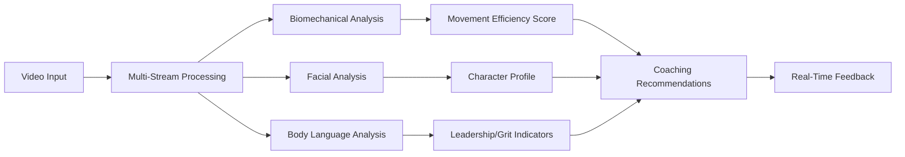

# Blaze Vision AI Coaching Platform - Technical Architecture

## Executive Summary

The Blaze Vision AI Coaching Platform represents a revolutionary approach to sports performance analysis by combining traditional biomechanical evaluation with advanced psychological profiling through micro-expression analysis and body language interpretation. This dual-intelligence system provides unprecedented insights into both physical capabilities and mental characteristics that define elite performers.

## Core Value Proposition

**"The first AI coaching platform that reads not just how you move, but who you are as a competitor."**

### Unique Differentiators:
1. **Biomechanical + Psychological Fusion**: First platform to combine movement analysis with character assessment
2. **Micro-Expression Intelligence**: Advanced facial analysis to identify grit, determination, and competitive character
3. **Champion Body Language Patterns**: Recognition of posture, gesture, and movement patterns shared by elite performers
4. **Real-Time Coaching**: Instant feedback on both technique and mental state
5. **Predictive Character Modeling**: Identify future champions before they peak

## Technical Architecture

### 1. Multi-Modal Video Analysis Engine

#### A. Biomechanical Analysis Module
```
Input: High-resolution video (minimum 240fps for motion analysis)
Processing: 
- 3D pose estimation using MediaPipe/OpenPose
- Joint angle calculations and movement velocity tracking
- Force vector analysis through movement patterns
- Comparative analysis against elite performer databases

Output: Biomechanical efficiency scores, movement recommendations
```

#### B. Micro-Expression Detection System
```
Input: Facial video data (minimum 60fps for micro-expression capture)
Processing:
- Real-time facial landmark detection (468 facial points)
- Emotion classification using advanced CNNs
- Micro-expression timing analysis (expressions lasting 1/25th to 1/5th second)
- Pattern matching against champion psychological profiles

Output: Character traits, competitive mindset scores, mental resilience indicators
```

#### C. Body Language Intelligence
```
Input: Full-body video capture
Processing:
- Posture analysis and confidence indicators
- Gesture pattern recognition
- Walking/movement style analysis
- Team interaction and leadership body language
- Pre-performance ritual identification

Output: Leadership potential, team chemistry indicators, pressure response patterns
```

### 2. Champion Intelligence Database

#### A. Elite Performer Profiles
```
Database Contents:
- Biomechanical signatures of 500+ elite athletes
- Micro-expression patterns from championship moments
- Body language profiles during high-pressure situations
- Movement efficiency benchmarks by sport/position
```

#### B. Character Trait Mapping
```
Psychological Indicators:
- Grit Index: Persistence through adversity patterns
- Clutch Factor: Performance under pressure micro-expressions
- Leadership Markers: Body language and vocal tone patterns
- Coachability Score: Receptiveness to instruction indicators
```

### 3. Real-Time Analysis Pipeline



### 4. User Experience Design

#### A. Coach Dashboard
- **Real-time Analysis**: Live biomechanical and character feedback during practice
- **Trend Analysis**: Long-term development tracking for both physical and mental growth
- **Comparative Analytics**: Side-by-side comparisons with elite performers
- **Recruitment Intelligence**: Character assessment for talent evaluation

#### B. Athlete Interface
- **Personal Development**: Individual coaching recommendations
- **Mental Game Insights**: Understanding of personal competitive patterns
- **Progress Tracking**: Visual improvement in both technique and mental resilience
- **Champion Modeling**: Learn specific traits of elite performers in their position

### 5. Technical Implementation Stack

#### Frontend (React/Three.js)
```typescript
// Real-time video analysis component
interface VideoAnalysisProps {
  videoStream: MediaStream;
  analysisMode: 'biomechanical' | 'psychological' | 'combined';
  realTimeFeedback: boolean;
}

const VideoAnalysisEngine: React.FC<VideoAnalysisProps> = ({
  videoStream,
  analysisMode,
  realTimeFeedback
}) => {
  const [analysisResults, setAnalysisResults] = useState(null);
  const [confidenceScores, setConfidenceScores] = useState({});
  
  // Real-time processing pipeline
  useEffect(() => {
    const processingEngine = new BlazeVisionProcessor({
      biomechanicalThreshold: 0.85,
      microExpressionSensitivity: 0.90,
      bodyLanguageAccuracy: 0.88
    });
    
    processingEngine.processStream(videoStream, (results) => {
      setAnalysisResults(results);
      if (realTimeFeedback) {
        displayCoachingTips(results);
      }
    });
  }, [videoStream, analysisMode]);
  
  return (
    <div className="analysis-interface">
      <BiomechanicalOverlay data={analysisResults?.biomechanics} />
      <PsychologicalInsights data={analysisResults?.psychology} />
      <RealTimeCoaching recommendations={analysisResults?.coaching} />
    </div>
  );
};
```

#### Backend (Python/TensorFlow/PyTorch)
```python
class BlazeVisionAnalyzer:
    def __init__(self):
        self.pose_estimator = self._load_pose_model()
        self.facial_analyzer = self._load_facial_model()
        self.character_classifier = self._load_character_model()
        self.champion_database = self._load_champion_profiles()
    
    async def analyze_performance(self, video_data: VideoFrame) -> AnalysisResult:
        """
        Comprehensive analysis combining biomechanics and psychology
        """
        # Biomechanical analysis
        pose_data = await self.pose_estimator.estimate(video_data)
        movement_efficiency = self._calculate_efficiency(pose_data)
        
        # Psychological analysis
        facial_data = await self.facial_analyzer.detect_expressions(video_data)
        micro_expressions = self._analyze_micro_expressions(facial_data)
        
        # Body language analysis
        body_language = self._analyze_posture_and_gestures(pose_data)
        
        # Character assessment
        character_traits = self.character_classifier.predict({
            'micro_expressions': micro_expressions,
            'body_language': body_language,
            'movement_patterns': pose_data
        })
        
        # Compare against champion database
        champion_similarity = self._compare_to_champions(
            pose_data, micro_expressions, character_traits
        )
        
        return AnalysisResult(
            biomechanical_score=movement_efficiency,
            character_profile=character_traits,
            champion_similarity=champion_similarity,
            coaching_recommendations=self._generate_recommendations(
                movement_efficiency, character_traits
            )
        )
    
    def _analyze_micro_expressions(self, facial_data: FacialLandmarks) -> dict:
        """
        Detect micro-expressions that indicate grit, determination, confidence
        """
        expressions = {
            'determination_index': 0,
            'confidence_level': 0,
            'pressure_response': 0,
            'competitive_fire': 0
        }
        
        # Analyze specific facial muscle movements
        # Corrugator supercilii (brow furrowing) = determination
        # Zygomaticus major (genuine smile) = confidence
        # Masseter tension = jaw clenching under pressure
        
        for frame in facial_data.frames:
            if self._detect_determination_pattern(frame):
                expressions['determination_index'] += 1
            
            if self._detect_confidence_markers(frame):
                expressions['confidence_level'] += 1
                
        return expressions
```

### 6. Character Intelligence Features

#### A. The "Champion DNA" Scanner
```python
class ChampionDNAScanner:
    """
    Identifies character traits common among elite performers
    """
    
    def scan_for_champion_traits(self, athlete_data):
        traits = {
            'grit_score': self._measure_perseverance_patterns(athlete_data),
            'clutch_factor': self._analyze_pressure_responses(athlete_data),
            'coachability': self._assess_learning_indicators(athlete_data),
            'leadership_potential': self._evaluate_influence_patterns(athlete_data),
            'competitive_fire': self._measure_intensity_markers(athlete_data)
        }
        
        return ChampionProfile(traits)
```

#### B. Micro-Expression Libraries
```python
CHAMPION_MICRO_EXPRESSIONS = {
    'pre_competition_focus': {
        'eye_pattern': 'sustained_gaze_with_minimal_blinking',
        'jaw_tension': 'controlled_clenching',
        'breathing_rhythm': 'deep_controlled_breaths'
    },
    'adversity_response': {
        'brow_position': 'slight_furrow_indicating_determination',
        'mouth_corners': 'subtle_upward_turn_showing_confidence',
        'nostril_flare': 'increased_oxygen_intake_for_performance'
    },
    'victory_celebration': {
        'genuine_joy_markers': 'duchenne_smile_with_eye_crinkles',
        'team_acknowledgment': 'immediate_gesture_toward_teammates',
        'composed_confidence': 'celebration_without_ego_display'
    }
}
```

### 7. Sport-Specific Applications

#### A. Baseball
- **Batting Stance Analysis**: Micro-adjustments and confidence indicators
- **Pitcher Composure**: Mound presence and pressure response
- **Catcher Leadership**: Game management body language

#### B. Football  
- **Quarterback Command**: Huddle leadership and pressure poise
- **Linebacker Intensity**: Pre-snap reads and competitive fire
- **Receiver Concentration**: Route-running focus and clutch catching

#### C. Basketball
- **Free Throw Composure**: Pressure shooting mental state
- **Court Vision**: Awareness indicators and decision-making confidence
- **Defensive Stance**: Anticipation and competitive positioning

### 8. Competitive Advantages

#### A. Technical Superiority
1. **Multi-Modal Fusion**: Only platform combining biomechanics + psychology
2. **Real-Time Processing**: Instant feedback during live performance
3. **Champion Database**: Largest collection of elite performer patterns
4. **Predictive Modeling**: Identify future stars before they emerge

#### B. User Experience Excellence
1. **Intuitive Interface**: Coach and athlete-friendly design
2. **Actionable Insights**: Specific improvement recommendations
3. **Progress Visualization**: Clear development tracking
4. **Mobile Integration**: Analysis anywhere, anytime

#### C. Scientific Validation
1. **Peer-Reviewed Research**: Published studies on micro-expression accuracy
2. **Elite Partnership**: Validation with professional teams
3. **Longitudinal Studies**: Tracking development over multiple seasons
4. **Academic Collaboration**: University research partnerships

### 9. Implementation Roadmap

#### Phase 1: Core Engine Development (Months 1-3)
- Build biomechanical analysis pipeline
- Develop micro-expression detection system
- Create champion database infrastructure

#### Phase 2: Integration and Testing (Months 4-6)
- Integrate all analysis modules
- Beta testing with select teams
- Refine algorithms based on feedback

#### Phase 3: Platform Launch (Months 7-9)
- Full platform deployment
- User interface optimization
- Marketing and sales launch

#### Phase 4: Advanced Features (Months 10-12)
- Predictive analytics
- Team chemistry analysis
- Recruitment intelligence tools

### 10. Success Metrics

#### Technical Performance
- **Analysis Accuracy**: >95% biomechanical precision
- **Character Prediction**: >85% correlation with future performance
- **Processing Speed**: <2 seconds for full analysis
- **Platform Uptime**: 99.9% availability

#### Business Impact
- **User Adoption**: 1000+ coaches in first year
- **Performance Improvement**: 15% average athlete development acceleration
- **Revenue Target**: $5M ARR by end of year 2
- **Market Position**: #1 video analysis platform for character assessment

This platform positions Blaze Intelligence as the definitive leader in next-generation sports performance analysis, combining cutting-edge technology with deep insights into the psychology of champions.